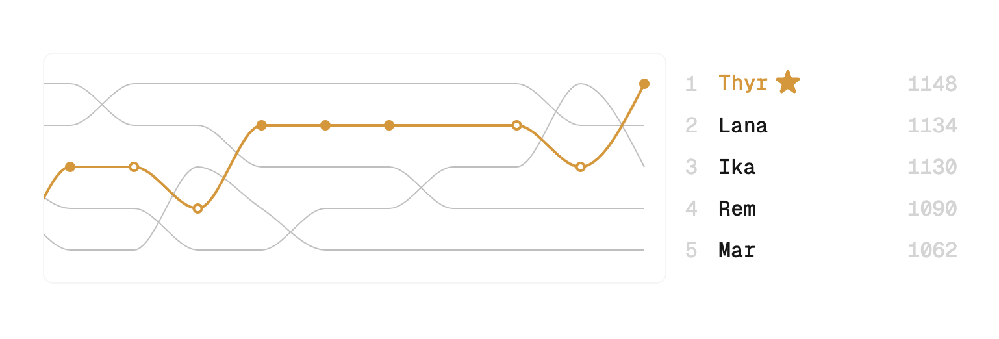

# Shmelo

A modern scoreboard application for tracking competitive game results, rankings, and winning streaks among friends.

## Features

- **Interactive Rankings**: Track player rankings with beautiful charts
- **Winning Streaks**: Keep track of winning streaks and player performance
- **Circle Management**: Create circles for different groups of players
- **Visual Statistics**: View performance trends with an intuitive bump chart
- **Game History**: Record and review game results
- **Dark Mode**: Supports both light and dark themes
- **Responsive Design**: Works seamlessly on desktop and mobile devices (however, desktop version has a better user experience)

## Tech Stack

- Next.js
- TypeScript
- Tailwind CSS
- Framer Motion
- D3
- Supabase

### Author

Made by [Ika](https://ika.im) • [Twitter/X](https://x.com/itsikap) • [Bluesky](https://bsky.app/profile/ika.im)
